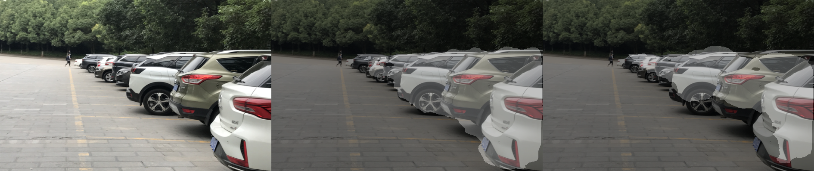
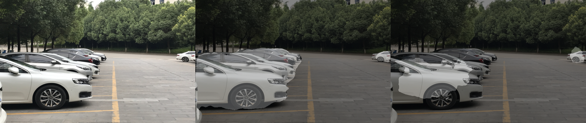
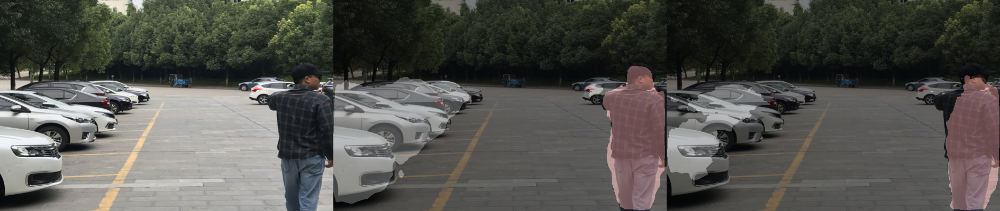
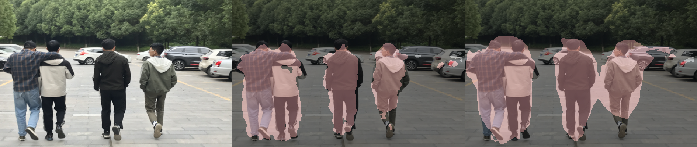
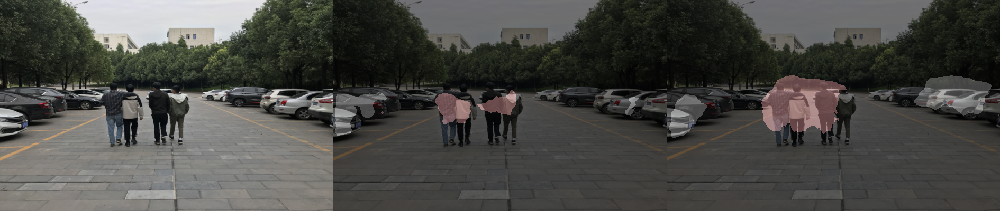
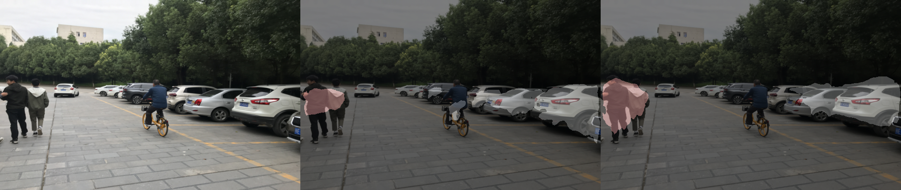
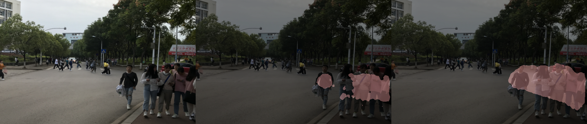
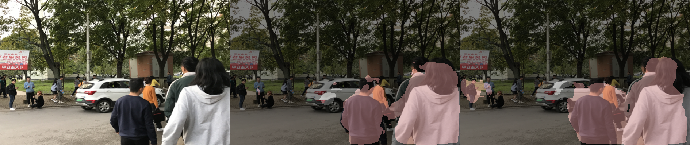
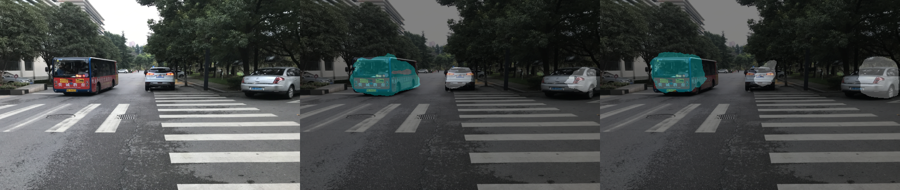

[English Document](./README.md)
# DeeplapV3+_ResNet_Res2Net_semantic_segmentation

仅仅需要下载VOC2012做数据集，随手拍的图片进行预测。预测结果不是很好，估计是训练集不够大。
VOC2012 download link:
[VOC2012 download link](http://host.robots.ox.ac.uk/pascal/VOC/voc2012/VOCtrainval_11-May-2012.tar)
## trained DeeplabV3+ using ResNet101 as backbone
No information
## trained DeeplabV3+ using Res2Net as backbone
No information
## Result

